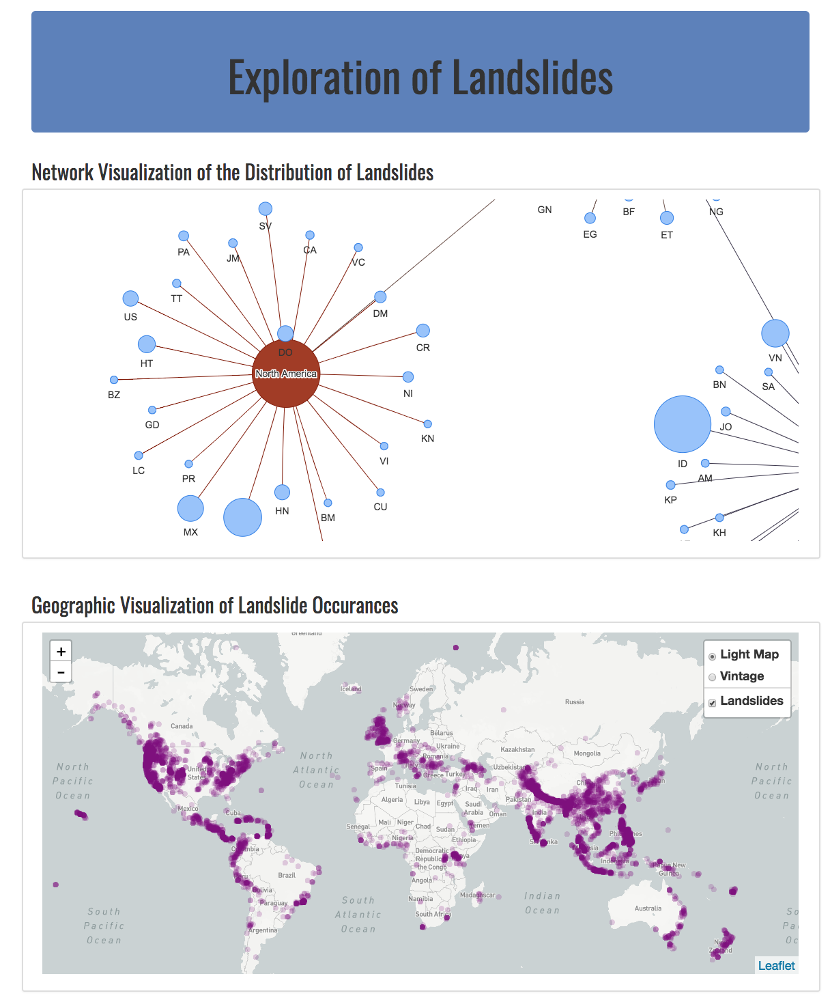
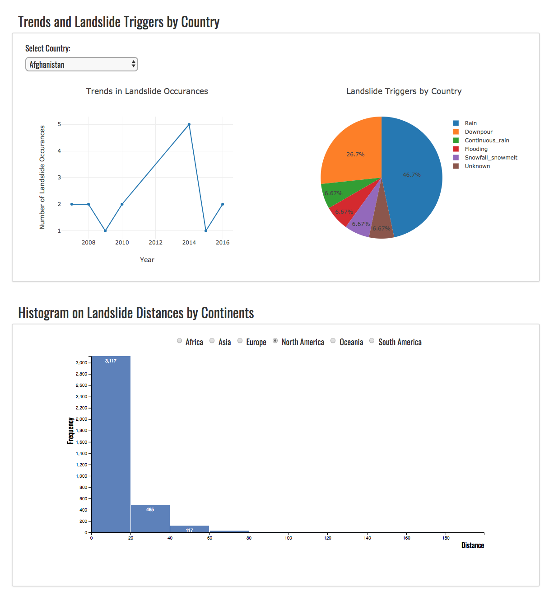

# Landslide Dashboard

This goal of this project was to create a JavaScript based dashboard on landslides based on the the Global Landslide Catalog (GLC). The dataset was extracted from the NASA's Open Data Portal.  This dataset on data.nasa.gov was a one-time export from the Global Landslide Catalog maintained separately. It is current as of March 7, 2016. The GLC considers all types of mass movements triggered by rainfall, which have been reported in the media, disaster databases, scientific reports, or other sources. The GLC has been compiled since 2007 at NASA Goddard Space Flight Center. 

#### Project Team:
* Andrew Price
* Ashely Na
* Antonio Kufoy
* Asela Dassanayake

#### Technology stack used in developing this web application is as follows:

* Back End: 
  * Flask
  * Heroku
  * PostgreSQL
  * SQLAlchemy ORM
  * Pandas
  * Python 3.6

* Front End: 
  * HTML/CSS/Bootstrap
  * Javascript
  * JS libraries used for plotting: D3.js, Plotly.js, Leaflet.js, Vis.js

#### Images from the final app

#### References :
##### Citations
    Kirschbaum, D. B., Adler, R., Hong, Y., Hill, S., & Lerner-Lam, A. (2010). A global landslide catalog for hazard applications: method, results, and limitations. Natural Hazards, 52(3), 561–575. doi:10.1007/s11069-009-9401-4. [1]

    Kirschbaum, D.B., T. Stanley, Y. Zhou (In press, 2015). Spatial and Temporal Analysis of a Global Landslide Catalog. Geomorphology. doi:10.1016/j.geomorph.2015.03.016. [2]